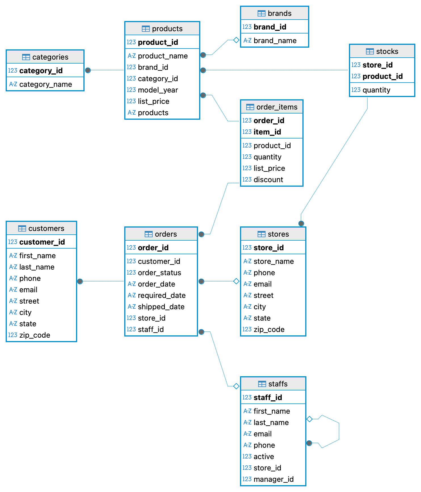
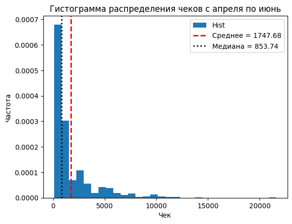
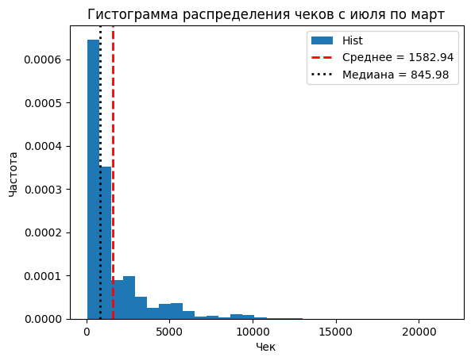
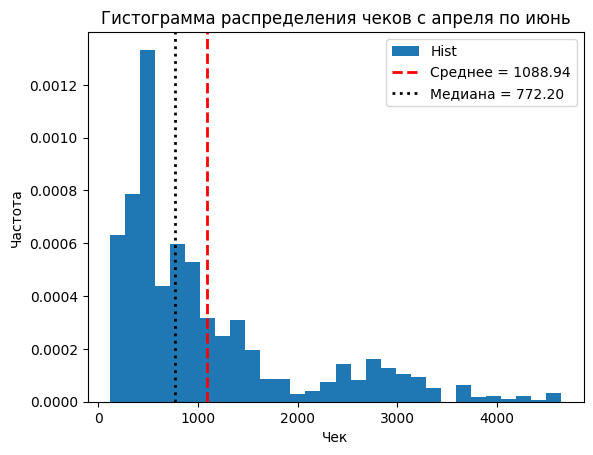
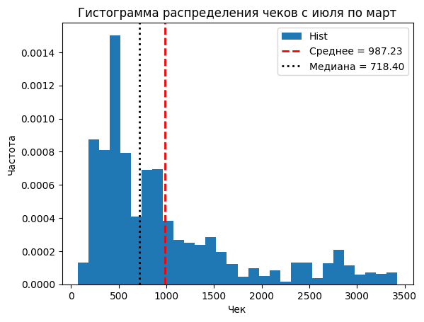

# Проект по продуктовой аналитике: Анализ магазина велосипедов
Данные были взяты [отсюда](https://www.kaggle.com/datasets/dillonmyrick/bike-store-sample-database/data). У нас имеется 9 таблиц, которые вместе могут образовать базу данных. 
Данные из сайта были выгружены локально к себе в DBeaver, где я настроил отношения между таблицами.

Вся реляционная база данных выглядит так: 

## Работа в DBeaver

В Dbeaver я делал MySQL запросы. Коды предоставлены [тут](./MySQL/)

## EDA анализ

## Проверка статистических гипотез

### Гипотеза 1: Скидка, большая или равная 10 процентов на первый заказ, влияет на увеличинии вероятности второго заказа в будущем
Эту гипотезу можно переформулировать так, чтобы проверить гипотезу о увеличении вероятности повторного заказа через N временных периодов, но данных мало, обойдемся таким способом.
Считаем метрику (вероятность) повторного заказа следующим образом:
$$

### Гипотеза 2: С апреля по июнь средний чек больше, чем в остальное время года
Такая гипотеза была взята из следующих соображений: в апреле-мая пик закупки велосипедов и дополнительных к нему вещей на летний период, в марте люди только разгоняются, в июне ажиотаж продолжается, в июле-августе катаются на велосипедах, так как закупились ранее.

$H_0$: Средние чеков равны - нулевая гипотеза

$H_1$: Средний чек с апреля по июнь больше среднего чека в остальное время года - альтернативая гипотеза

#### Проверка через t-test:
1) Сначала работаем с выбросами, так как выбросы - это дорогие покупки, которые имеют смысл в нашем случае. Они отвечают за определенный сегмент покупателей.
   Посмотри на распределения данных:
   
   

   

   ___p-value = 0.018 < 0.05 <=> отвергаем нулевую гипотезу___

3) Убираем выбросы, используя понятие boxplot (ящик с усами). Получаем следующее распределения:

   

   

   ___p-value = 0.001 < 0.05 <=> отвергаем нулевую гипотезу___

#### Проверка через бутстреп:

