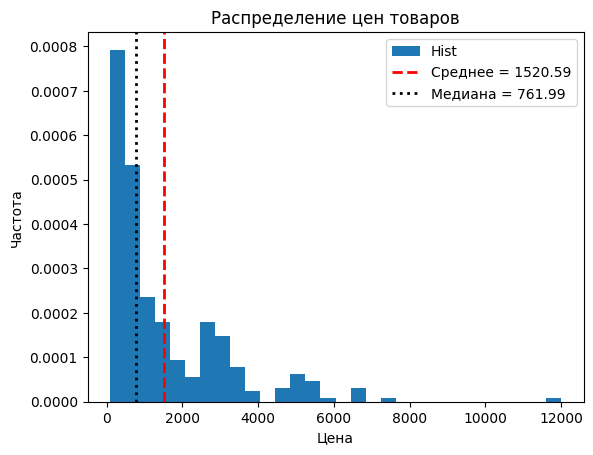
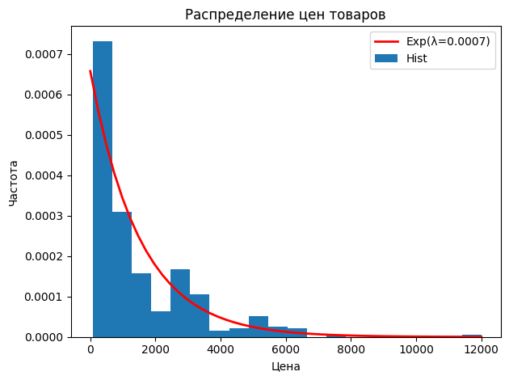
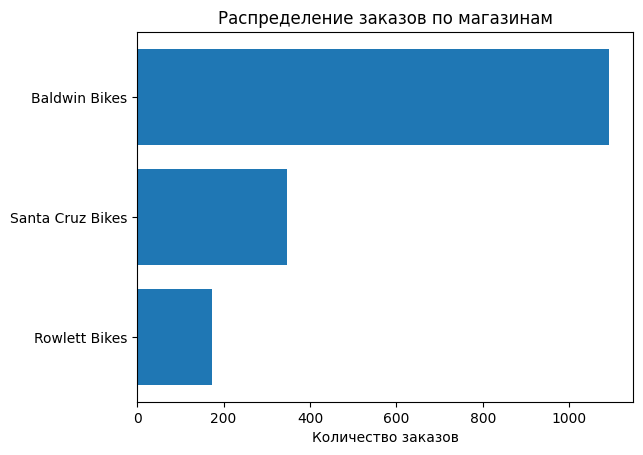
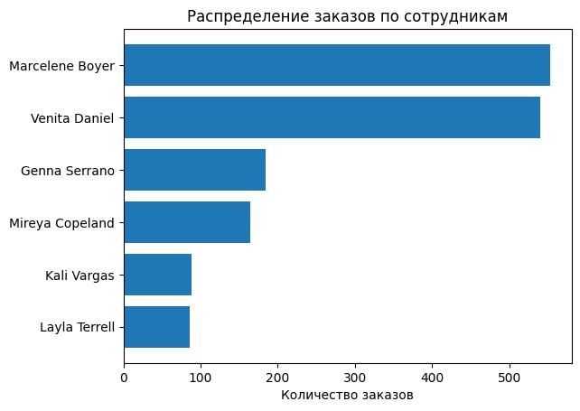
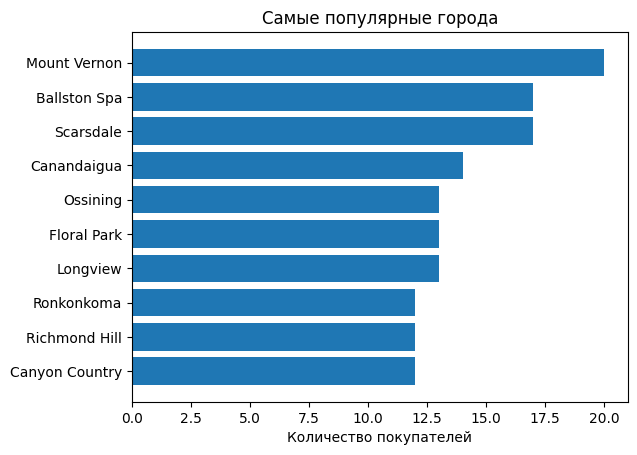
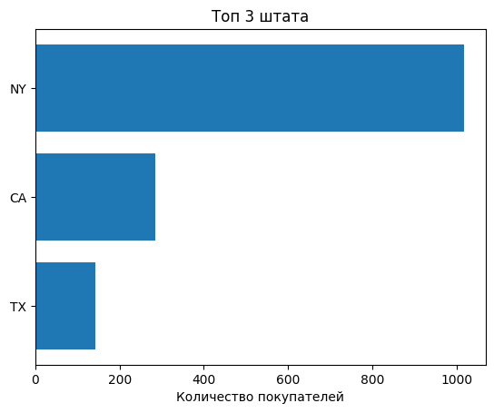
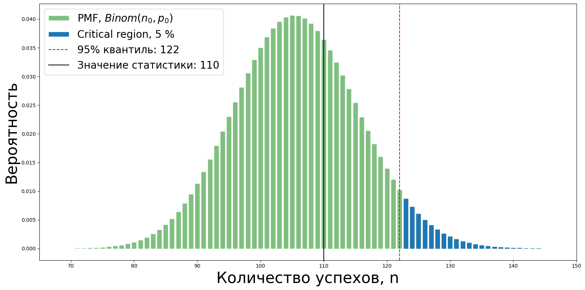

# Проект по продуктовой аналитике: Анализ магазина велосипедов
Данные были взяты [отсюда](https://www.kaggle.com/datasets/dillonmyrick/bike-store-sample-database/data). У нас имеется 9 таблиц, которые вместе могут образовать базу данных. В таблицах имеется следующая информация: покупатели, их заказы, стафф, продукты в магазине, их категории, бренды, магазины.

Данные из сайта были выгружены локально к себе в DBeaver, где я настроил отношения между таблицами.

Вся реляционная база данных выглядит так: 

## Работа в DBeaver и Python

В Dbeaver я делал MySQL запросы. Скрипты предоставлены [тут](./MySQL/).

Вся обработка данных происходила на Python. Все вычисления представлены в [этом ноутбуке](./AnalyticsProject1.ipynb)

## EDA анализ

### Временной ряд покупок:
Простроим зависимость количество заказов от времени и посмотрим на тенденцию. Для анализа этого используем следующий [датасет](./DATA/customers_orders_discount_rk.csv), который был создан с помощью [такого скрипта](./MySQL/customers_orders_discount_rk_sql.sql).

Временной ряд выглядит так:

Построим на гистограмму данных:

### Категории товаров
Для анализа использовались [эти данные](./DATA/categories_brands.csv), выгруженные с помощью [этого скрипта](./MySQL/categories_brands_sql.sql).

Построим круговую диаграмму, выглядит она так:

Самая популярная категория - Cruisers Bicycles, дальше примерно в равных пропорциях 3 категории - Mountain Bikes, Road Bikes, Children Bicycles.

### Бренды

Для анализа использовался тот же датасет, что и в предыдущем загаловке.

Посмотрим на распределение брендов по товарам:

Trek и Electra доминируют во всем рынке, их доля от всего рынка больше 75 процентов.

### Товары

Выгрузим [все данные о товарах](/DATA/products.csv) через [этот скрипт](./MySQL/products_sql.sql) и посмотрим на распеределение цен:

Видим, что есть выбросы, но они связаны с дорогими товарами. Распределение напоминает экспоненциальное. Оценим параметр, по которому эти данные распределены. Оценить параметр можем через Метод Максимального Правдоподобия. Для эспоненицального распределения оценка $\theta = 1/ \bar X $, где $\bar X$ - выборочное среднее от всей выборки.

### Магазины
Всего имеется 3 магазина.

Будем анализровать на [этом маленьком датасете](./DATA/orders_stores.csv), который был создан через [данный скрипт](.MySQL/orders_stores_sql.sql)

Распределение заказов по магазинам выглядит так:

### Стафф
Во магазинах имеется 9 сотрудников, 4 из которых являются менеджерами. 

Используем [эти данные](./DATA/orders_staff.csv), используя [этот скрипт](./MySQL/orders_staff_sql.sql).

Так выглядит распределение заказов по сотрудникам:

Стоит уточнить, что Venita	Daniel и Mireya Copeland являются менеджерами. Видим, что Venita	Daniel и Marcelene Boyer занимают первые 2 места по заказам.

### Покупатели
Всего в базе имеется 1445 уникальных покупателей. Для анализа используем [этот датасет](./DATA/customers.csv), который был выгружен с помощью [такого скрипта](./MySQL/customers_sql.sql).

Рассмотрим на распределение их по городам:

Рассмотрим на распределение покупателей по штатам:

## Проверка статистических гипотез

### Гипотеза 1: Скидка, большая или равная 10 процентов на первый заказ, влияет на увеличинии вероятности второго заказа в будущем
Эту гипотезу можно переформулировать так, чтобы проверить гипотезу о увеличении вероятности повторного заказа через N временных периодов, но данных мало, обойдемся таким способом.
Считаем метрику (вероятность) повторного заказа следующим образом:

$P_0$ = количество покупателей, которые за все время совершили хотя бы 1 повторный заказ / общее количество уникальных покупателей за все время
P_0 = 0.09

$p$ - вероятность повторного заказа, если в 1 заказе была скидка, большая или равная 10 процентов.

$H_0: p = P_0$ - основная гипотеза

$H_1: p > P_0$ - альтерантивная гипотеза

Каждый покупатель, который в первом заказе получил скидку, большую или равную 10 процентам, с вероятность $p$ совершит повторный заказ в будущем, то есть такую случайную величину можно описать так:

$X_i$ ~ $Bern(p)$ 

$Q = X_1 + ... + X_n$ ~ $Binom(n,p)$

Ошибка 1 рода (отвержение верной нулевой гипотезы) ограничена 5 процентами. 

Запишем статистический критерий: $Q > a$, 

где $a$ - 0.95 квантиль биномиального распределения (примерный 0.95 квантиль, так как биномиальное распределение дискретное)

___Реализация статистики q = 110 < a = 122 <=> не отвергаем нулевую гипотезу___

### Гипотеза 2: С апреля по июнь средний чек больше, чем в остальное время года
Такая гипотеза была взята из следующих соображений: в апреле-мая пик закупки велосипедов и дополнительных к нему вещей на летний период, в марте люди только разгоняются, в июне ажиотаж продолжается, в июле-августе катаются на велосипедах, так как закупились ранее.

$H_0$: Средние чеков равны - нулевая гипотеза

$H_1$: Средний чек с апреля по июнь больше среднего чека в остальное время года - альтернативая гипотеза

#### Проверка через t-test:
1) Сначала работаем с выбросами, так как выбросы - это дорогие покупки, которые имеют смысл в нашем случае. Они отвечают за определенный сегмент покупателей.
   Посмотри на распределения данных:
   
   

   

   ___p-value = 0.018 < 0.05 <=> отвергаем нулевую гипотезу___

3) Убираем выбросы, используя понятие boxplot (ящик с усами). Получаем следующее распределения:

   

   

   ___p-value = 0.001 < 0.05 <=> отвергаем нулевую гипотезу___

#### Проверка через бутстреп:

