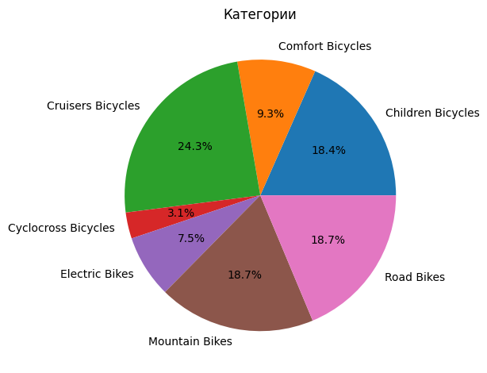
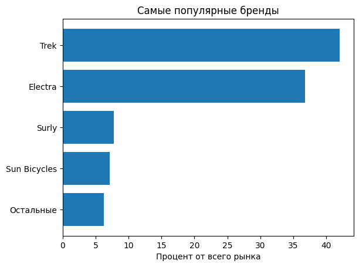
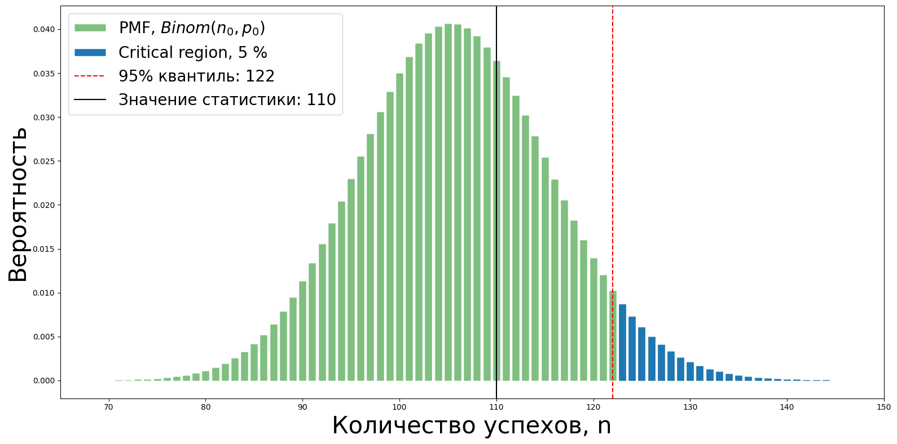

# Проект по продуктовой аналитике: Анализ магазина велосипедов
Данные были взяты [отсюда](https://www.kaggle.com/datasets/dillonmyrick/bike-store-sample-database/data). У нас имеется 9 таблиц, которые вместе могут образовать базу данных. В таблицах имеется следующая информация: покупатели, их заказы, стафф, продукты в магазине, их категории, бренды, магазины.

Данные из сайта были выгружены локально к себе в DBeaver, где я настроил отношения между таблицами.

Вся реляционная база данных выглядит так: 

## Работа в DBeaver

В Dbeaver я делал MySQL запросы. Скрипты предоставлены [тут](./MySQL/)

## EDA анализ

### Категории товаров
Для анализа использовались [эти данные](./DATA/categories_brands.csv), выгруженные с помощью [этого скрипта](./MySQL/categories_brands_sql.sql):

Построим круговую диаграмму, выглядит она так:

Самая популярная категория - Cruisers Bicycles, дальше примерно в равных пропорциях 3 категории - Mountain Bikes, Road Bikes, Children Bicycles.

### Бренды

Для анализа использовался тот же датасет, что и в предыдущем загаловке.

Посмотрим на распределение брендов по товарам:

Trek и Electra доминируют во всем рынке, их доля от всего рынка больше 75 процентов.

### Товары

### Магазины
Всего 3 магазина, посмотрим на распределение заказов во всех 3 магазинов

### Стафф
Во магазинах имеется 9 стаффоф, 4 из которых являются менеджерами. 

Используем [эти данные](./DATA/orders_staff.csv), используя [этот скрипт](./MySQL/orders_staff_sql.sql)

### Покупатели

## Проверка статистических гипотез

### Гипотеза 1: Скидка, большая или равная 10 процентов на первый заказ, влияет на увеличинии вероятности второго заказа в будущем
Эту гипотезу можно переформулировать так, чтобы проверить гипотезу о увеличении вероятности повторного заказа через N временных периодов, но данных мало, обойдемся таким способом.
Считаем метрику (вероятность) повторного заказа следующим образом:

$P_0$ = количество покупателей, которые за все время совершили хотя бы 1 повторный заказ / общее количество уникальных покупателей за все время
P_0 = 0.09

$p$ - вероятность повторного заказа, если в 1 заказе была скидка, большая или равная 10 процентов.

$H_0: p = P_0$ - основная гипотеза

$H_1: p > P_0$ - альтерантивная гипотеза

Каждый покупатель, который в первом заказе получил скидку, большую или равную 10 процентам, с вероятность $p$ совершит повторный заказ в будущем, то есть такую случайную величину можно описать так:

$X_i$ ~ $Bern(p)$ 

$Q = X_1 + ... + X_n$ ~ $Binom(n,p)$

Ошибка 1 рода (отвержение верной нулевой гипотезы) ограничена 5 процентами. 

Запишем статистический критерий: $Q > a$, 

где $a$ - 0.95 квантиль биномиального распределения (примерный 0.95 квантиль, так как биномиальное распределение дискретное)

___Реализация статистики q = 110 < a = 122 <=> не отвергаем нулевую гипотезу___

### Гипотеза 2: С апреля по июнь средний чек больше, чем в остальное время года
Такая гипотеза была взята из следующих соображений: в апреле-мая пик закупки велосипедов и дополнительных к нему вещей на летний период, в марте люди только разгоняются, в июне ажиотаж продолжается, в июле-августе катаются на велосипедах, так как закупились ранее.

$H_0$: Средние чеков равны - нулевая гипотеза

$H_1$: Средний чек с апреля по июнь больше среднего чека в остальное время года - альтернативая гипотеза

#### Проверка через t-test:
1) Сначала работаем с выбросами, так как выбросы - это дорогие покупки, которые имеют смысл в нашем случае. Они отвечают за определенный сегмент покупателей.
   Посмотри на распределения данных:
   
   

   

   ___p-value = 0.018 < 0.05 <=> отвергаем нулевую гипотезу___

3) Убираем выбросы, используя понятие boxplot (ящик с усами). Получаем следующее распределения:

   

   

   ___p-value = 0.001 < 0.05 <=> отвергаем нулевую гипотезу___

#### Проверка через бутстреп:

